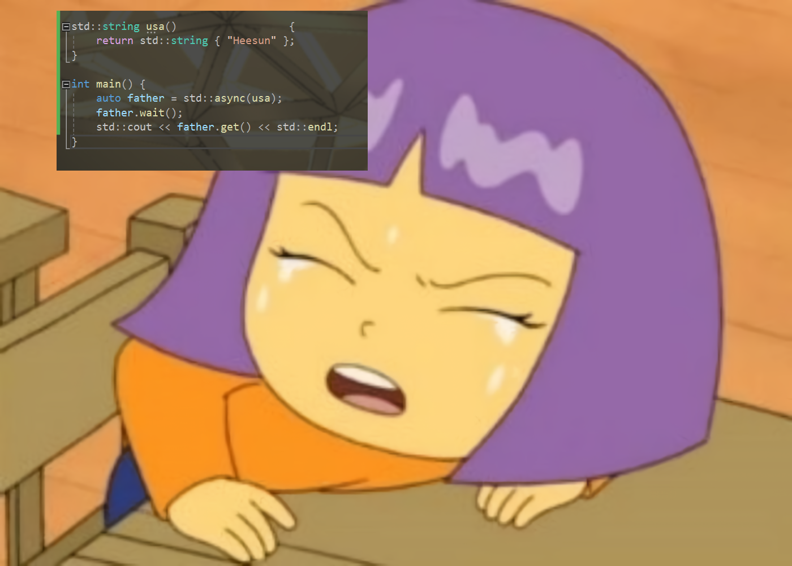

# Profile

### A Common Engineering Bay  
- C / C++ (11 ~ 20) / Rust / Assembly (x86 - 64 / x86 / AVR / ARM / ARM-THUMB)
- Kernel / Driver (KMDF / UMDF / Linux Kernel Module) / FPGA / Virtualization (KVM / Hyper - V)
- Storage (SCSI / SATA / NVMe) / PCI / PCI - Express

# Introduction to C Programming

---

#### ~~Title : Sir, "goto void" is same with "jmp void". ~~

#### ~~Is... his / her name "void*" too?~~
